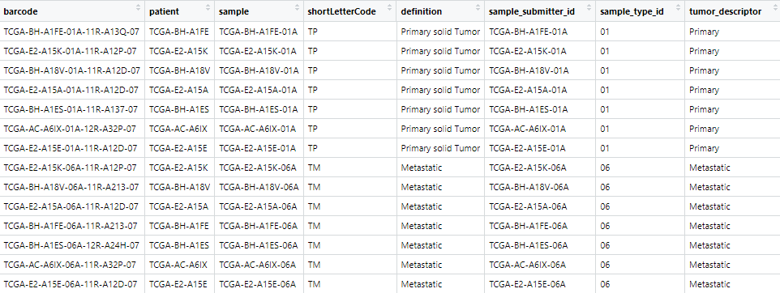
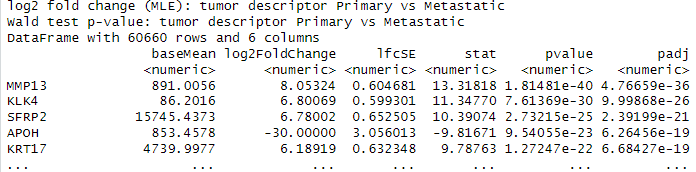
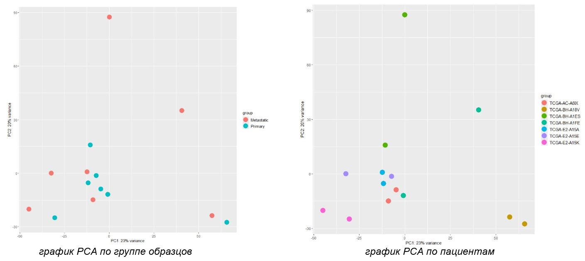
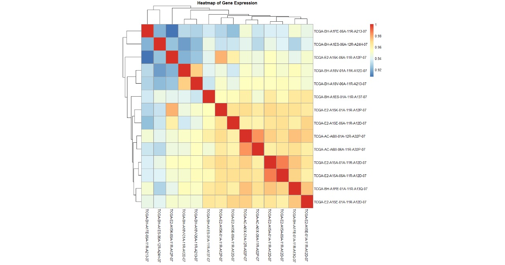
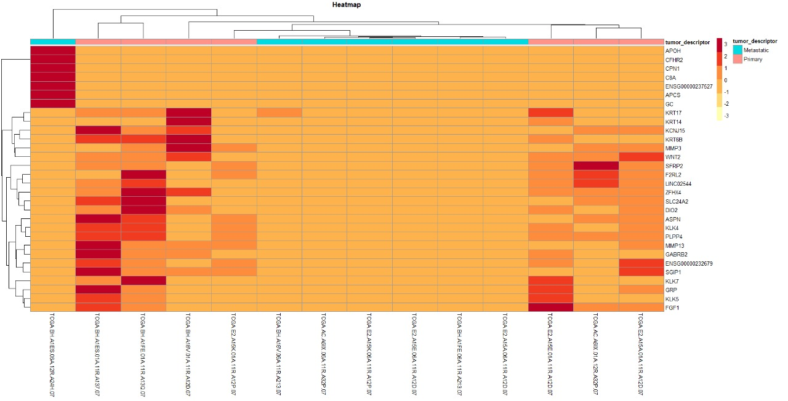
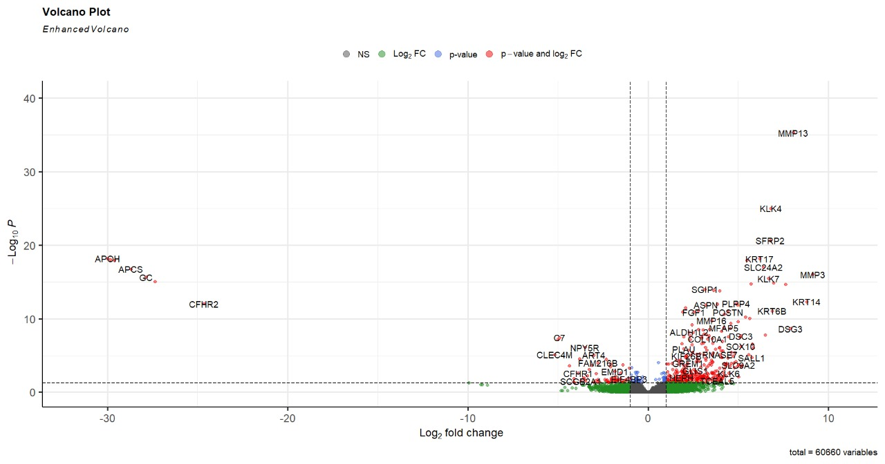

# Данное исследование было проведено в рамках итоговой аттестационной работы по программе проффессиональной переподготовки "Биоинформатика".

## Тема:
Анализ общедоступных данных РНК-секвенирования опухолевых образцов из базы данных TCGA.

## Цель работы:
Проведение анализа данных RNA-seq опухолевых образцов молочной железы с целью выявления генов с дифференциальной экспрессией между образцами первичной опухоли и метастазами.

## Задачи работы:
1. Загрузка и предварительная обработка данных: получение исходных данных РНК-секвенирования опухолевых образцов молочной железы из базы данных TCGA и их  редварительная обработка для нормализации и
фильтрации.
2. Анализ дифференциальной экспрессии генов: использование DESeq2 для выявления генов, чей уровень экспрессии различается между образцами первичной опухоли и метастазами молочной железы.
3. Визуализация результатов: построение графиков PCA, Heatmap и Volcano-plot для визуализации различий в экспрессии генов между образцами и выделения наиболее значимых генов.

## Результаты:
**1.** Загружены исходные данные РНК-секвенирования опухолевых образцов молочной железы из общедоступной базы данных TCGA и проведена предварительная обработка.

**2.** Проведен анализ дифференциальной экспрессии с использованием пакета DESeq2.

**В результате анализа были выявлены гены, чей уровень экспрессии значимо различается между образцами первичной опухоли и метастазами.**

**3.** Для визуализации результатов анализа были построены графики:

**PCA**

 **Heatmap:** корреляция между экспрессией генов в образцах

 **Heatmap:** 30 генов с наиболее выраженной дифференциальной экспрессией.

**Volcano-plot** 

## Вывод:
**В рамках проведенного исследования:**
- Загружены данные из базы TCGA,  проведена нормализация и фильтрация образцов
- Проведен анализ дифференциальной экспрессии генов с использованием пакета DESeq2 
- Визуализированы результаты при помощи графиков PCA, Heatmap, Volcanoplot

**В результате проведения анализа данных RNA-seq** опухолевых образцов молочной железы были выявлены гены с дифференциальной экспрессией между образцами первичной опухоли и метастазами.

Полученные результаты анализа могут быть использованы в следующих областях:
- Идентификация ключевых генов
- Функциональный анализ
- Поиск потенциальных биомаркеров
- Разработка терапевтических стратегий
- Дальнейшие исследования